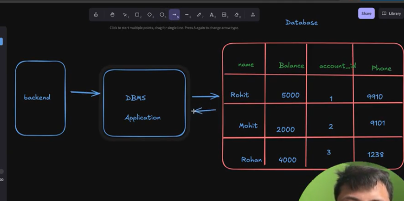
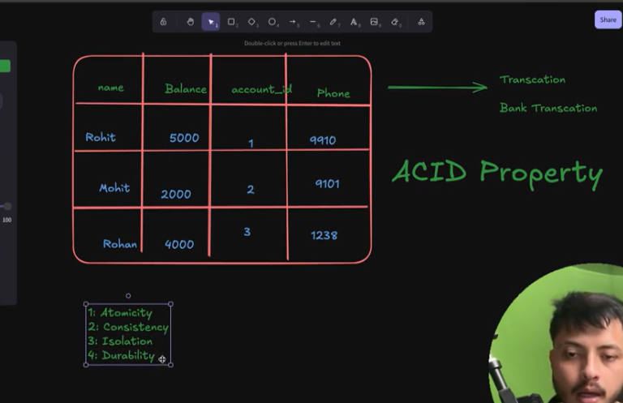

*creating first server  ....1*............................>

const express = require("express")
const app = express()

app.use("/contact", (req, res) => {
    res.send("Hello contact me")
})
app.use(/^\/details?$/, (req, res) => { //? menas optional "s"
    res.send("Hello my details")
})

app.use(/^\/details?$/, (req, res) => { //? menas multiple  "s" can be applies 
    res.send("Hello my details")
})

app.use("/details/:id", (req, res) => { //: menas   return id localhost:3000/details/10 return 10
    console.log(req.params.id)
    res.send("Hello my name is " + req.params.id)
})

app.use("/", (req, res) => {
    res.send("Hello coder army")
})  // this need to be write at last  another top code should not work .ok 

app.listen(3000, () => {
    console.log("listing as port 3000")
})

*lecture note 2*------------------------>

*json  & java script obj both are different ? how?*
=> there are loots of diffference  google it
**we convert json to js object by express.json()**
=>if we send {"name":"dev"} as a json it came in js object  { name: 'dev' }

const express = require("express")
const server = express();

server.use(express.json())   //with out writtng this req.body become undefined .........ok ? this is use for purshing data  
server.post("/user",(req,res)=>{
    console.log(req.body)
    res.send("data saved successfully")
    console.log("Data saved successfully ")
})

server.use("/", (req, res) => {
    res.send("hello")
    // console.log(req) //there is lotos of data that is came by serevr
})

server.listen(3000, () => {
    console.log("server started")
})

...................................................................................................

"use" chorke "get ,post ,path etc " all are work based on full words they are not check first character like /date only / match in "use" ,/data totally match happen in "post ,pathct etc"

...........................................................................................

const express = require("express")
const app = express()
app.use(express.json())

**const bookStore = [
    {
        id: 1,
        name: "harry potter",
        auther: "DevFlux"
    },
    {
        id: 2,
        name: "Friends",
        author: "Vikash"
    },
    {
        id: 2,
        name: "Nexus",
        author: "Rohit"

    }, {
        id: 3,
        name: "premKhani",
        author: "Dev"

    }
]**
app.get(("/book/:id"), (req, res) => {
    const id = parseInt(req.params.id)
    const book = bookStore.find(info => info.id === id)
    res.send(book)
})
app.get("/book", (req, res) => {
    res.send(bookStore)
})

app.post("/book", (req, res) => {
    bookStore.push(req.body)
    res.send("Data saved successfully")
})
app.listen(3000, () => {
    console.log("server started")
})

**...........................................day 8.....................................................**

const express = require("express")
const app = express()
app.use(express.json())

const bookStore = [
    {
        id: 1,
        name: "harry potter",
        author: "DevFlux"
    },
    {
        id: 2,
        name: "Friends",
        author: "Vikash"
    }, {
        id: 3,
        name: "premKhani",
        author: "Dev"

    }
]
app.get("/book", (req, res) => {
    res.send(bookStore)
})
app.patch("/book", (req, res) => { // for updating single things  at once we use it 
    res.send("Patch updated")
    const id1 = req.body.id
    const Book = bookStore.find(info => info.id === id1)
    if (req.body.auther) {
        Book.author = req.body.author
    }
    if (req.body.name) {
        Book.name = req.body.name
    }
    console.log(bookStore)
})
app.put("/book", (req, res) => { // for updating multiple things  at once we use it 
    const id1 = req.body.id
    const Book = bookStore.find(info => info.id === id1)
    Book.author = req.body.author
    Book.name = req.body.name
    res.send("Patch updated")
})

app.delete("/book/:id", (req, res) => {
    const id = parseInt(req.params.id)
    const index = bookStore.findIndex(info => info.id === id)
    console.log(index)
    bookStore.splice(index, 1);
    res.send("deleted sucessfully")
})

app.get("/book1", (req, res) => {
    console.log(req.query.author)
    const book =bookStore.filter(info => info.author === req.query.author)
    console.log(book)
    res.send(book)
})
app.listen(3000, () => {
    console.log("server started")
})

**.......................................middleware..........................................................**

<!-- log mentain karna hota hai  -->

const express = require("express")
const app = express();
app.use(express.json());

// all about middle ware

app.use("/", (req, res, next) => {
    res.send("Hello ji")
    console.log(1)
    next()
}, (req, res) => {
    console.log(2)
    // res.send("Hello ji2")  //not possible two response sending 
}
)
app.listen(3000, () => {
    console.log("server started at 3000")
})

<!-- ...................................day 9................................. -->
******************************lets create swiggy backned*********************************************

status code=> 

***********************************lecture10**********************************************
<!-- try catch ...error  handeling -->
try{

}
cath(err){
    res.send("some error occur")
}
.......................................................................................................
                                                                                                      .
why we use express.json() ,why not we use  json.parse(JSON)                                           .          =>?                                                                                                   .
ans=>express.json() at the end json.parse(JSON) use karrehe internaily                                .
                                                                                                      .
.......................................................................................................

*******************************dataBase connection************************************
>excel sheet  fileManager is not a data base cause we not aplly qurryies there excel sheets has limit  
>dataBse & DBMS me mongodb is DBMS
Diagram=> 

database is physical system and DBMS is management system

sql=> structure qurry data base means row and colou database 
mongoDm=b is  **nosql** 

=>we store video in file stroage and store link in mongo db ....
=>yotube is file-stroage system for video 😊😊😊
=>also store meta data in data base 
=>meatdata is the information abou photo or video that we store i dbms , only informaton
<!-- ..................Problem is sql dataBase.................... -->

=>ACID => 

<!-- ...............................lecture150.......................... -->
=> instlling mongo db commnd in npm=>npm i mongodb
=> but we dont use this we use moongose
doccumentation url =>

**What is mongosh ?**
=>for better 

........................day16.........................

***all operaton id db***

const mongoose = require("mongoose")
async function main() {
    await mongoose.connect("mongodb://localhost:27017/dbLecture16")

    const userSchema = new mongoose.Schema({//cretaimg schema then we need to create model means collection create karna  //schema = structure
        name: String,
        age: Number,
        city: String,
        gender: String
    })

    const User = mongoose.model("user", userSchema)//creating model  //no need to write await 
    // const user1 = new User({ name: "Rohit", age: 20, city: "kolkata", gender: "Male" }) //single insertion line1
    //   await userMany.save(); //single insertion  line2
    await User.insertMany([{ name: "Rohit3", age: 20, city: "kolkata", gender: "Male3" },
    { name: "Rohit2", age: 20, city: "kolkata2", gender: "Male2" }]) //multiple insertion 

    const answer = await User.find({name:"Rohit"}); // find somthing from db
    console.log(answer)

}

main()
    .then(() => { console.log("connectd db") })
    .catch((err) => console.log(err))

.......................................................................................

***best doccument  for mongo db**
url is =>

......................................................
is authorization is validator ?
=>no 

?>why need api level validation ?
=> reason is to reduce db cost & read write operation

>>>>we storw different salt for different in dataBAse , alo store them in db for future login for that  we use bcrypt libray

.....................how to use bcrypt libray........................

const bcrypt = require("bcrypt")
const password = "Rohit@123"
async function hashingme() {
    console.time("hash")
    const salt =await bcrypt.genSalt(10) //generating salt 
    const hashPass = await bcrypt.hash(password, salt) //generating password
    console.timeEnd("hash")
    console.log(hashPass)
    console.log(salt)
    const ans = await  bcrypt.compare("Rohit@123",hashPass) //this is use to to comapre password here
    console.log(ans)
}
hashingme()

...........................validator npm libray.........................
=> it is use for validation in api level

..................cookie-parser....................................
for that we need to use npm i cookie-parser
& need to install npm i jsonwebtoken this for token genarator
>const jwt=require("jsonwebtoken")
app.use(cookieParser())
>const token = jwt.sign({ _id: people._id, emailId: people.emailId }, "secret_key_your",{expiresIn:100}) //cookies  genarate  -no meed await here 
>const cookieParser=require("cookie-parser")

 //index16.js @21 folder

<!-- .....................refreh token .................. -->
better then jwt , we need to take axcestoken waild very less time , refresh token vaild for very high time 

if passwor dchange then refresh token invaild possible but axcess token not invaild  happen 
rferesh token has no formate it is only a random string and it is store in dB(rsdis) best if you store in dB as a hash encrypted so that if it is store but then nothing should be happen
 formate is => **hashcode:wdgywsgydshewafshbgysahf ,name**

....................creating methods in schema lecture 23 ..................
=>no so inportant lecture ...just for extra knowledge

<!-- need to write this line after installing env require('dotenv').config() -->

...............installing radis  from mongo db.........................

