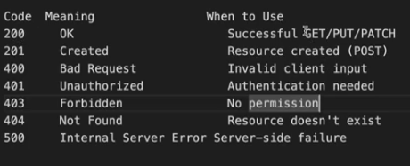

*creating first server  ....1*............................>

const express = require("express")
const app = express()

app.use("/contact", (req, res) => {
    res.send("Hello contact me")
})
app.use(/^\/details?$/, (req, res) => { //? menas optional "s"
    res.send("Hello my details")
})

app.use(/^\/details?$/, (req, res) => { //? menas multiple  "s" can be applies 
    res.send("Hello my details")
})

app.use("/details/:id", (req, res) => { //: menas   return id localhost:3000/details/10 return 10
    console.log(req.params.id)
    res.send("Hello my name is " + req.params.id)
})

app.use("/", (req, res) => {
    res.send("Hello coder army")
})  // this need to be write at last  another top code should not work .ok 

app.listen(3000, () => {
    console.log("listing as port 3000")
})

*lecture note 2*------------------------>

*json  & java script obj both are different ? how?*
=> there are loots of diffference  google it
**we convert json to js object by express.json()**
=>if we send {"name":"dev"} as a json it came in js object  { name: 'dev' }

const express = require("express")
const server = express();

server.use(express.json())   //with out writtng this req.body become undefined .........ok ? this is use for purshing data  
server.post("/user",(req,res)=>{
    console.log(req.body)
    res.send("data saved successfully")
    console.log("Data saved successfully ")
})

server.use("/", (req, res) => {
    res.send("hello")
    // console.log(req) //there is lotos of data that is came by serevr
})

server.listen(3000, () => {
    console.log("server started")
})

...................................................................................................

"use" chorke "get ,post ,path etc " all are work based on full words they are not check first character like /date only / match in "use" ,/data totally match happen in "post ,pathct etc"

...........................................................................................

const express = require("express")
const app = express()
app.use(express.json())

**const bookStore = [
    {
        id: 1,
        name: "harry potter",
        auther: "DevFlux"
    },
    {
        id: 2,
        name: "Friends",
        author: "Vikash"
    },
    {
        id: 2,
        name: "Nexus",
        author: "Rohit"

    }, {
        id: 3,
        name: "premKhani",
        author: "Dev"

    }
]**
app.get(("/book/:id"), (req, res) => {
    const id = parseInt(req.params.id)
    const book = bookStore.find(info => info.id === id)
    res.send(book)
})
app.get("/book", (req, res) => {
    res.send(bookStore)
})

app.post("/book", (req, res) => {
    bookStore.push(req.body)
    res.send("Data saved successfully")
})
app.listen(3000, () => {
    console.log("server started")
})

**...........................................day 8.....................................................**

const express = require("express")
const app = express()
app.use(express.json())

const bookStore = [
    {
        id: 1,
        name: "harry potter",
        author: "DevFlux"
    },
    {
        id: 2,
        name: "Friends",
        author: "Vikash"
    }, {
        id: 3,
        name: "premKhani",
        author: "Dev"

    }
]
app.get("/book", (req, res) => {
    res.send(bookStore)
})
app.patch("/book", (req, res) => { // for updating single things  at once we use it 
    res.send("Patch updated")
    const id1 = req.body.id
    const Book = bookStore.find(info => info.id === id1)
    if (req.body.auther) {
        Book.author = req.body.author
    }
    if (req.body.name) {
        Book.name = req.body.name
    }
    console.log(bookStore)
})
app.put("/book", (req, res) => { // for updating multiple things  at once we use it 

    const id1 = req.body.id
    const Book = bookStore.find(info => info.id === id1)
    Book.author = req.body.author
    Book.name = req.body.name
    res.send("Patch updated")
})

app.delete("/book/:id", (req, res) => {
    const id = parseInt(req.params.id)
    const index = bookStore.findIndex(info => info.id === id)
    console.log(index)
    bookStore.splice(index, 1);
    res.send("deleted sucessfully")
})

app.get("/book1", (req, res) => {
    console.log(req.query.author)
    const book =bookStore.filter(info => info.author === req.query.author)
    console.log(book)
    res.send(book)
})
app.listen(3000, () => {
    console.log("server started")
})

**.......................................middleware..........................................................**

<!-- log mentain karna hota hai  -->

const express = require("express")
const app = express();
app.use(express.json());

// all about middle ware

app.use("/", (req, res, next) => {
    res.send("Hello ji")
    console.log(1)
    next()
}, (req, res) => {
    console.log(2)
    // res.send("Hello ji2")  //not possible two response sending 
}
)
app.listen(3000, () => {
    console.log("server started at 3000")
})

<!-- ...................................day 9................................. -->
******************************lets create swiggy backned*********************************************

status code=> 

***********************************lecture10**********************************************
<!-- try catch ...error  handeling -->
try{

}
cath(err){
    res.send("some error occur")
}

why we use express.json() ,why not we use  json.parse(JSON) =>?
ans=>express.json() at the end json.parse(JSON) use karrehe internaily

